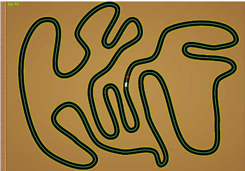

# Autonomous-RC-Car-Steering-with-CNN
A deep learning system for steering angle prediction, enabling an autonomous RC car with onboard camera to follow lanes in real time

Presentation on how I trained my model: https://youtu.be/0oAa8iI22iY?si=UYJbMC15-k3Q4FFP

# Introduction:
This project focuses on designing a deep learning model to predict steering angles for a PiCar, an RC car equipped with a camera, to enable it to navigate a track autonomously. The model processes input images from the PiCar’s camera and outputs steering angles, allowing the car to follow lane markings. We explored multiple machine learning approaches, starting with a linear regression model, progressing to a dense neural network (NN), and finally adopting a Convolutional Neural Network (CNN) to achieve optimal performance. This report details the methodology, model evolution, results, and real-world deployment of the final CNN model on the PiCar.

# Objective:
The primary goal of this project was to design and train a deep neural network capable of processing input images from the PiCar’s camera and accurately predicting steering angles to navigate lanes. The model was trained on a dataset of images with corresponding steering angles, tested on a separate validation set, and deployed on the PiCar for real-world evaluation.
Methodologies:

# Data Collection
The dataset was collected using the PiCar simulator, a software tool that simulates the PiCar’s camera and steering behavior on virtual tracks. Images from the simulated camera were paired with corresponding steering angles as the PiCar navigated various tracks. A total of 8,000 images were collected. The dataset was split into 5,000 images for training and 3,000 for testing to evaluate model performance.
To optimize the dataset, I collected multiple sets of data on different track configurations within the PiCar simulator to determine which track provided the best dataset for training. I theorized that if the model struggled to turn at challenging corners or hairpins, it would benefit from training on a track with a significant number of sharp turns and hairpins. This theory proved partially successful. Initially, when the model was trained on the default track in the PiCar simulator and tested on a more difficult simulated track with sharp turns, it would veer off the track when encountering hard, sharp, or wide turns. However, training on a simulated track with a good amount of sharp turns and hairpins improved the model’s performance on tracks with challenging turns.
During this process, I faced challenges with data collection in the simulator. When collecting data on a track, like the one shown in Figure 1, featuring excessively sharp hairpins and turns, the PiCar would go off the track during data collection, corrupting the dataset. To address this, I found it effective to collect data on the simulated track presented in Figure 2. This track features reasonably sharp turns that the car could navigate without difficulty during data collection. Additionally, I incorporated straightaways, wide turns, and chicanes into the track design to prepare the model for a variety of elements it might encounter. This balanced approach to data collection resulted in a model that performed consistently across different simulated tracks during testing, and later on real-world tracks when deployed

