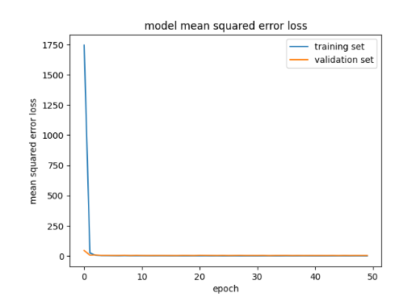

# Autonomous-RC-Car-Steering-with-CNN
A deep learning system for steering angle prediction, enabling an autonomous RC car with onboard camera to follow lanes in real time

Presentation on how I trained my model: https://youtu.be/0oAa8iI22iY?si=UYJbMC15-k3Q4FFP

# Introduction:
This project focuses on designing a deep learning model to predict steering angles for a PiCar, an RC car equipped with a camera, to enable it to navigate a track autonomously. The model processes input images from the PiCar’s camera and outputs steering angles, allowing the car to follow lane markings. We explored multiple machine learning approaches, starting with a linear regression model, progressing to a dense neural network (NN), and finally adopting a Convolutional Neural Network (CNN) to achieve optimal performance. This report details the methodology, model evolution, results, and real-world deployment of the final CNN model on the PiCar.

# Objective:
The primary goal of this project was to design and train a deep neural network capable of processing input images from the PiCar’s camera and accurately predicting steering angles to navigate lanes. The model was trained on a dataset of images with corresponding steering angles, tested on a separate validation set, and deployed on the PiCar for real-world evaluation.
Methodologies:

# Data Collection
The dataset was collected using the PiCar simulator, a software tool that simulates the PiCar’s camera and steering behavior on virtual tracks. Images from the simulated camera were paired with corresponding steering angles as the PiCar navigated various tracks. A total of 8,000 images were collected. The dataset was split into 5,000 images for training and 3,000 for testing to evaluate model performance.
To optimize the dataset, I collected multiple sets of data on different track configurations within the PiCar simulator to determine which track provided the best dataset for training. I theorized that if the model struggled to turn at challenging corners or hairpins, it would benefit from training on a track with a significant number of sharp turns and hairpins. This theory proved partially successful. Initially, when the model was trained on the default track in the PiCar simulator and tested on a more difficult simulated track with sharp turns, it would veer off the track when encountering hard, sharp, or wide turns. However, training on a simulated track with a good amount of sharp turns and hairpins improved the model’s performance on tracks with challenging turns.
During this process, I faced challenges with data collection in the simulator. When collecting data on a track, like the one shown in Figure 1, featuring excessively sharp hairpins and turns, the PiCar would go off the track during data collection, corrupting the dataset. To address this, I found it effective to collect data on the simulated track presented in Figure 2. This track features reasonably sharp turns that the car could navigate without difficulty during data collection. Additionally, I incorporated straightaways, wide turns, and chicanes into the track design to prepare the model for a variety of elements it might encounter. This balanced approach to data collection resulted in a model that performed consistently across different simulated tracks during testing, and later on real-world tracks when deployed

Figure 1: Track with excessively sharp hairpins and turns

Figure 2: Balanced track used for data collection 

# Model Selection  
The project progressed through three distinct models to achieve the desired performance. A linear regression model was initially employed as a baseline by treating image pixels as flattened features. But it also did not leverage the spatial relations of the images, and its validation loss was 0.12, which is extremely high. For better performance, a dense neural network (NN) with three hidden layers having 512, 256, and 128 neurons was attempted next. While this model reduced the validation loss to 0.07, it did not translate spatial patterns well, so the transition was made to a more suitable architecture. 
Recognizing the need for a model that could leverage spatial hierarchies in images, we transitioned to a Convolutional Neural Network (CNN) and developed two architectures for comparison. The first CNN model included three convolutional layers with 32, 64, and 128 filters (3x3 kernels), each succeeded by a 2x2 max-pooling layer. After flattening, it comprised five dense layers (128, 64, 32, 16, and 1 neuron), employing ReLU activation for all hidden layers and a linear activation for the output layer to perform regression. This model was trained using the Adam optimizer with a learning rate of 0.001 and mean squared error (MSE) as the loss function for 50 epochs with a batch size determined by the dataset (BATCH_SIZE). The implementation details of this model are shown in Figure 3.

Figure 3: Code implementation of the first CNN model

The second CNN model, our final model, had two convolutional layers with 36 filters (4x4 kernels) and 72 filters (4x4 kernels), both followed by a 4x4 max-pooling layer. After flattening, it had a denser layer structure with the following neurons: 56 (ReLU), 1200 (sigmoid), 1 (linear), 1200 (sigmoid), 48 (ReLU), 24 (ReLU), 1 (linear). Like the first model, it was trained with the Adam optimizer and a learning rate of 0.001 and MSE loss, for over 50 epochs, and the.h5 file size was approximately 2.7 MB. The implementation details of this model are shown in Figure 4.

Figure 4: Code implementation of the second CNN model

The two CNN models differed in several key aspects. The first model used more convolutional layers (three rather than two) with smaller kernel sizes (3x3 rather than 4x4) and smaller pooling windows (2x2 rather than 4x4), leading to a deeper feature extraction process but potentially losing some spatial information through extreme downsampling. In contrast, the second model reduced the number of convolutional layers but increased the kernel and pooling sizes to be able to recognize larger spatial features, such as lane markings. Additionally, the dense layer structure of the second model was more complex, with larger layers (e.g., 1200 neurons) and the inclusion of sigmoid activations, which likely stabilized the regression output for steering angles. Overall, the second model's design was better than the task involved because it traded feature extraction for a denser but more expressive layer configuration that ultimately yielded superior performance.

# Results
The performance of the models was evaluated using validation loss (MSE) on the test dataset. The linear regression model achieved a validation loss of 0.12, while the dense NN improved this to 0.07. Both CNN models significantly outperformed the earlier approaches.
First CNN Model: The validation loss stabilized around 2.1 after 50 epochs, as shown in the training history.
Second CNN Model: The final model achieved a lower validation loss, reaching as low as 1.8 after 50 epochs, indicating better predictive accuracy for steering angles.
Figure 1 below illustrates the training and validation loss for the second CNN model over 50 epochs. Both the training and validation losses decreased rapidly within the first 10 epochs and stabilized thereafter, with the validation loss consistently lower than the training loss, suggesting good generalization without overfitting.

Figure 5: Training and Validation Loss for the Second CNN Model

To further illustrate the performance of the second CNN model, Figure 2 presents a sample of training data with predicted and actual steering angles alongside corresponding input images from the PiCar simulator. The images show various track segments with lane markings, and the predicted steering angles are consistently close to the actual values, with differences typically within 1-3 degrees. For example, in one instance, the model predicted a steering angle of 96.49 degrees compared to an actual angle of 96.16 degrees, demonstrating high accuracy. This close alignment between predicted and actual steering angles across a range of track scenarios (e.g., sharp turns and wider curves) highlights the model’s ability to generalize effectively, a result of the balanced data collection strategy that included diverse track elements like sharp turns, hairpins, and chicanes.

Figure 6: Sample Training Data with Predicted vs. Actual Steering Angles

The second CNN model was first tested on the PiCar simulator, and it ran on 3 different tracks with increasing difficulty. The model did very well, achieving a score of 100 on each track. Then the model was uploaded to the PiCar and tested on a physical track with a signal lane. The model successfully navigated the general direction of the track, maintaining lane discipline and correctly predicting steering angles in real time. Although both CNN models had similar validation loss trends, the second model consistently achieved a lower validation loss (1.8 vs. 2.1), indicating better predictive accuracy. Its architecture, with larger kernels and a more complex, dense layer structure, was better suited for capturing the spatial patterns of lane markings and mapping them to steering angles. Therefore, the second CNN model was selected for deployment on the PiCar.

# Conclusion
This project successfully built a deep learning model that was able to perform steering angle prediction for a PiCar that was able to drive autonomously on road lane markings in simulation as well as in real-world environments. By evolving from a linear regression model to a dense neural network and eventually to a Convolutional Neural Network (CNN), we were able to demonstrate the significance of spatial feature extraction in computer vision tasks. The final CNN model with an optimized architecture featuring larger kernels (4x4), fewer convolutional layers, and a complicated dense layer configuration achieved a validation loss of 1.8, which was less than the 2.1 loss of the initial CNN model. The improvement further carried over into real-world performance since the model captured lane discipline with a score of 100 on three increasingly difficult tracks in the PiCar simulator and was able to navigate a real track, including maintaining lane discipline with great precision. For instance, the model predicted steering angles between 1-3 degrees of true values, such as 96.49 degrees against a ground truth of 96.16 degrees, illustrating its precision across different track scenarios. The data collection strategy of balanced data, consisting of sharp turns, hairpins, straights, and chicanes within the PiCar simulator, was important in ensuring the model's ability to generalize across different track types. This project proved the effectiveness of CNNs in autonomous systems and presented valuable insights into data collection, model design, and hyper-parameter tuning. Future improvements could include expanding the dataset with more diverse track conditions, optimizing for real-time operation, or introducing additional sensors like LiDAR to make more precise navigation.
